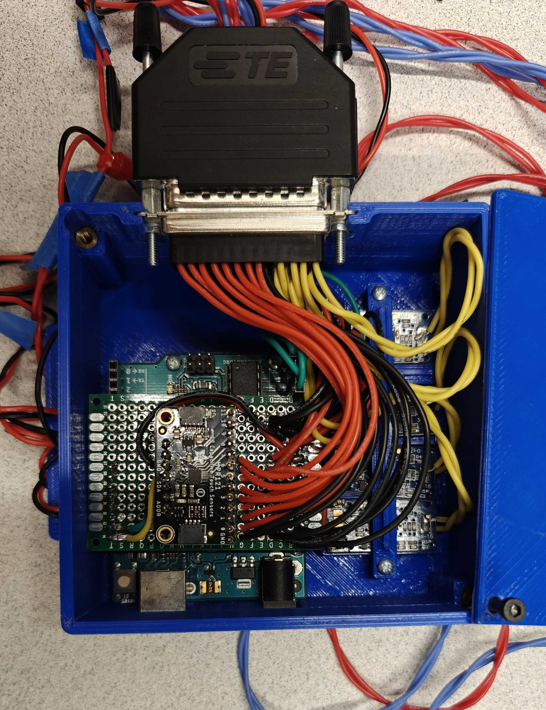
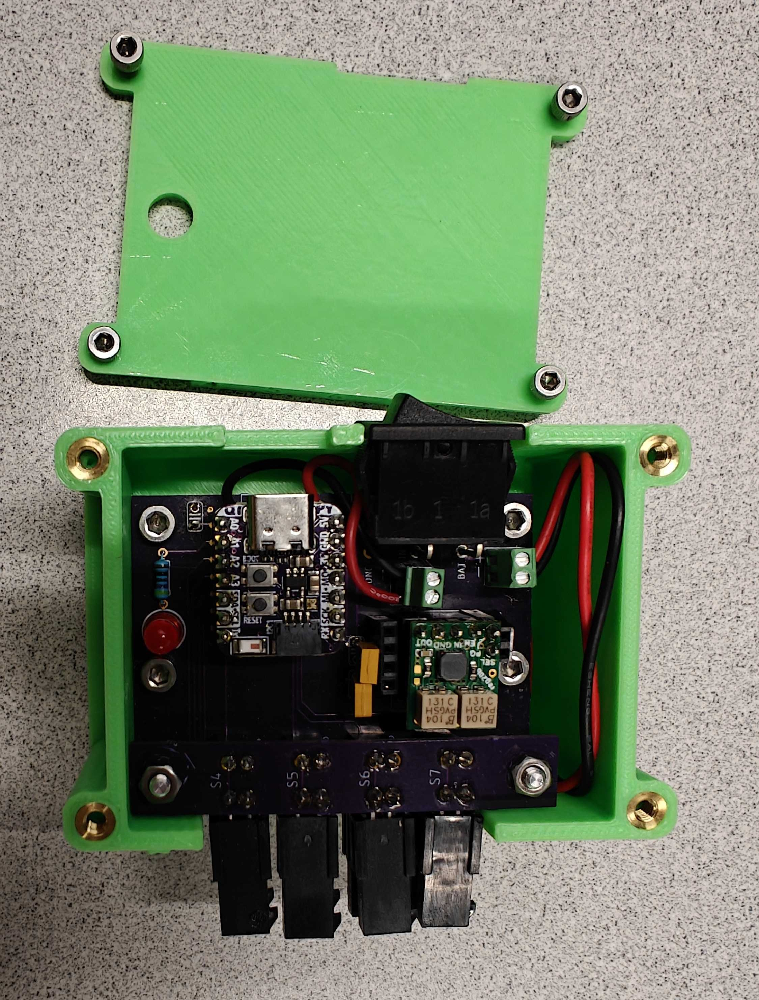
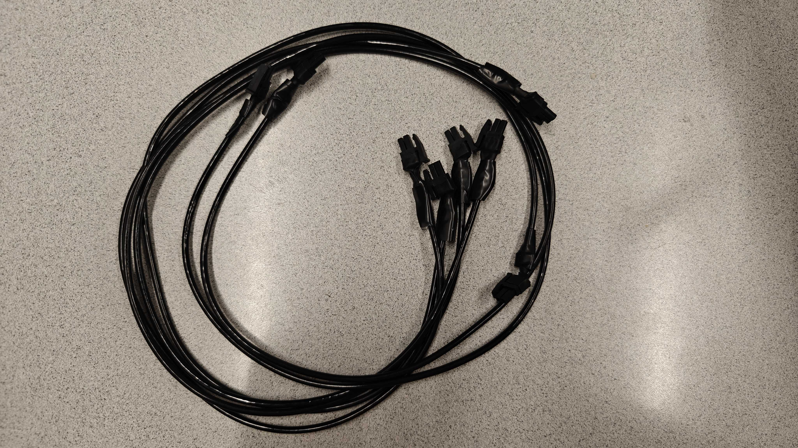

# Exo_Fabric_Sensor_Controller
This is the exoboot controller that fuses the exoboots and fabric sensor.

## Before using this branch
Make sure you have a connection between PC and the soft sensor. 

### DAQ of soft sensor:
1. Current use (built by UML NERVE team): check the `soft_sensor_daq` folder, and find the `sensor driver documentation.pdf` to see the current hardware setup. 

   In the `sensor drive documentation.pdf` file, the project box includes the rubber sensor driver, which is no longer used.
   
   
   
   Load `MPR121_driver_BodySuit_test.ino` to the Arduino board. This file is from The Faboratory lab at Yale University [url](https://www.eng.yale.edu/faboratory/).
   
   To log soft sensor data alone, you can use `com_log_four_sensors.py` file.
   Make sure all FOUR sensors are connected, and the Python script will read data from pin 0 to pin 3. In my case, pin 0  is left hip sensor; pin 1 is left knee; pin 2 is right hip; pin3 is right knee.
   
2. Another setup from UML NERVE team: Use esp-32 and Arduino BLE to build the DAQ of the soft sensor.[Details here](https://github.com/jacobbreen25/nsf_soft_sensor_data_collection).
  
   
   
   In this git repo, this setup is not used since this project box does not include the MPR121 board, as Yale team is using. 
3. If you need to build your own hardware, you can use Arduino Uno and MPR121 board only to build the Daq of the soft sensor. Also, to have clean sensor readings, the cable that connects the Arduino and soft sensor suit has to be well insulated. Try not to sue the cable as shown in the `sensor drive documentation.pdf` file. An example of well-insulated cables could be:

   

### Communication between soft sensor and exoboots
The soft sensors are not directly communicating with exoboots (not send sensor data to the exoboot board). Instead, the soft sensor readings are sent to the PC via USB cable, as well as exoboot readings. The detailed logic is written in the `main_launch_Hip_Phase.py` file.

## This branch is used for replacing manually tuned parameters with hip sensor readings
1. Use the maximum hip extension (MHE) time to replace the peak time.
2. Use the maximum hip extension (MHE) value to replace the normalized peak torque parameter.
3. The rise/fall times are proportional to the peak time.

## Reference
If the MoCap system is used to check the accuracy of the gait event estimation, use [Rizzoli Markersets](https://v23.wiki.optitrack.com/index.php?title=Rizzoli_Markersets#Rizzoli_Body_Protocol.2837.29) for the marker placement on the subject.

## Contribution
(Internal usage only)

Zenan Zhu, [TRACE lab](https://www.thetracelab.com/)

